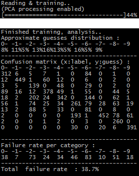

This is a simple minimum-distance classifier for the MNIST dataset, along with the [Fashion-MNIST](https://github.com/zalandoresearch/fashion-mnist) dataset.

The executable (classifier.py) directly reads from the data/ directory. It does take a few options (pass "help" as an argument to get a list).

Dependencies :
 - numpy & matplotlib are mandatory
 - scikit-learn is required for PCA (which is disabled by default)

